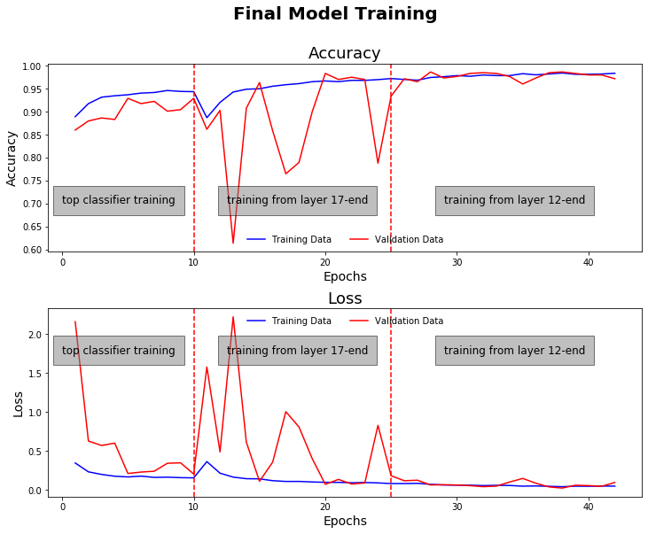

# PneumoniaNet 
A neural network for COVID-19 detection
[Blog](https://RajeshArasada.github.io)
# Deep neural network for COVID-19 detection in Chest X-rays
[](https://travis-ci.org/joemccann/dillinger)

```
Domain 		: Computer Vision, Machine Learning
Sub-Domain	: Deep Learning, Image Recognition
Techniques	: Deep Convolutional Neural Network, Transfer Learning, VGG19
Application	: Image Classification, Medical Imaging, Bio-Medical Imaging
```


## Description
Description
* Identification of COVID-19 pneumonia positive chest X-rays from other non COVID-19 viral pneumonia chest X-rays.
* COVID19 positive images were collected from covid-chestxray-dataset and viral pneumonia images were collected from NIH Chest X-ray dataset.
* 28 COVID-19 chest X-rays and 30 non-COVID-19 viral chest X-ray images were set aside as test data.
* ~150 of the remaining COVID-19 chest X-rays were augmented and the increased their size to ~600.
* Employed transfer learning and fine-tuned the pretrained VGG19 Convolutional Neural Network weights to distinguish COVID-19 positive chest X-rays from other viral chest X-rays. 
* Used Tensorflow 2.0 for model training. Incrementally unfroze and tuned all layers in the network.
* Attained a loss (categorical crossentropy) 0. 227 and an accuracy 97% on the test data


## Dataset Details

Dataset Name		    :[covid-chestxray-dataset](https://github.com/ieee8023/covid-chestxray-dataset), [chest X-ray](http://www.cell.com/cell/fulltext/S0092-8674(18)30154-5)
Original Publication: [Identifying Medical Diagnoses and Treatable Diseases by Image-Based Deep Learning](https://www.kaggle.com/paultimothymooney/chest-xray-pneumonia)

Number of Classes		: 2

## Tools/ Libraries
```
Languages	    : Python
Tools/IDE	    : Jupyter. Notebook
Libraries	    : TensorFlow 2.0, VGG19
```

## Model Training


## Performance Metrics
| Dataset | Training | Test |
| ------- | -------- | ---------- |
| Accuracy | 0.99	| 0.97 |
| Loss | 0.04223 | 0.2275 |
| Precision (COVID/ Non-COVID)| 0.96/0.99 | 1.0/ 0.94 |
 | Recall (COVID/ Non-COVID)| 0.93/0.99 |	0.93/1.0 |

## Model and Training Parameters
| Parameter | Value |
| --------- | ----- |
| Base Model |VGG19	| 
| Optimizer | RMSProp, Stochastic Gradient Descent |
| Loss Function | Categorical Crossentropy |
| Learning Rate | 0.0001 |
| Batch Size | 32 |
| Number of Epochs | Round #15 & #2: 15 epochs, Round#3: 25 epochs |	
 

## Confusion Matrices


# Test Predictions

